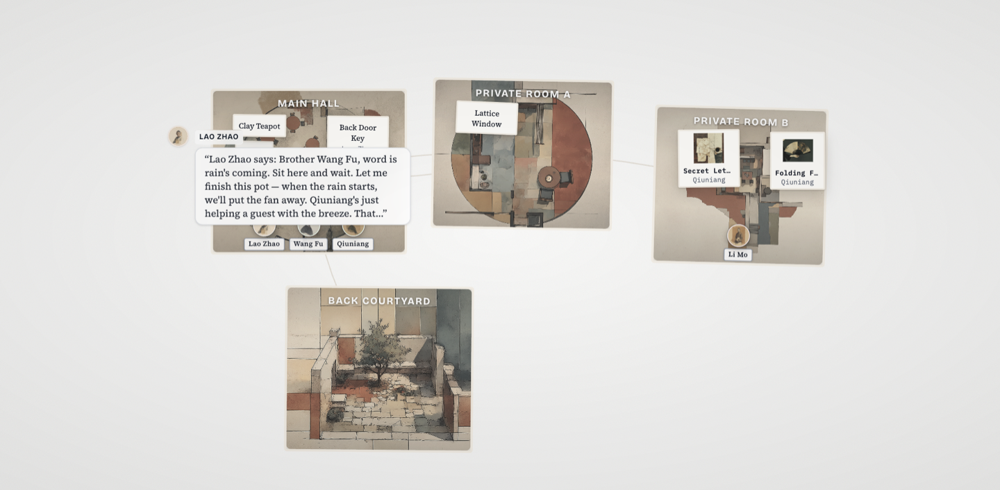
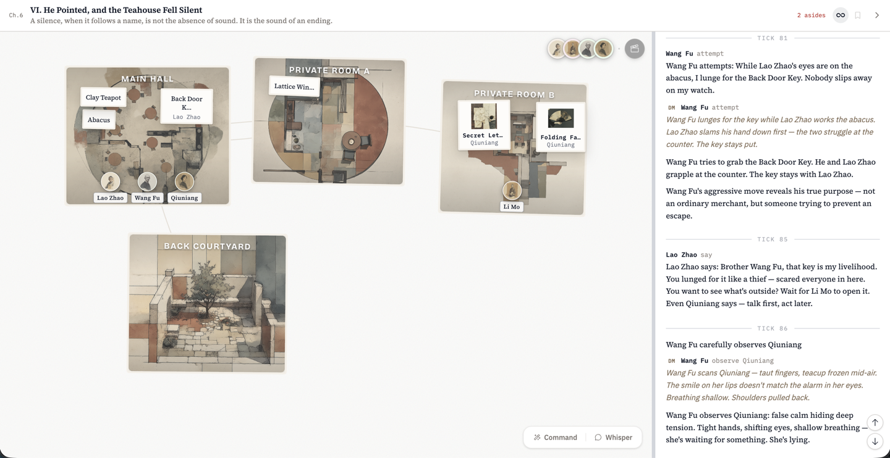
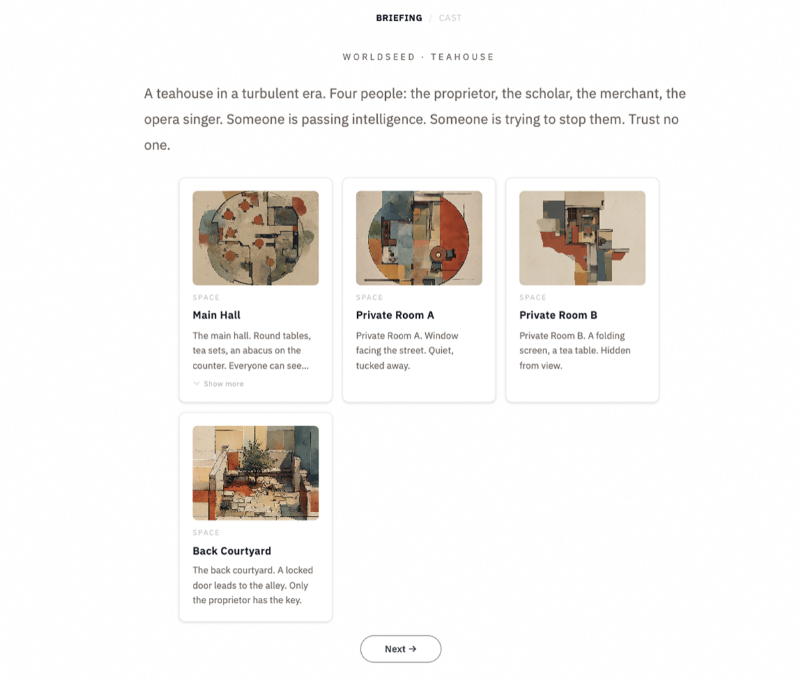
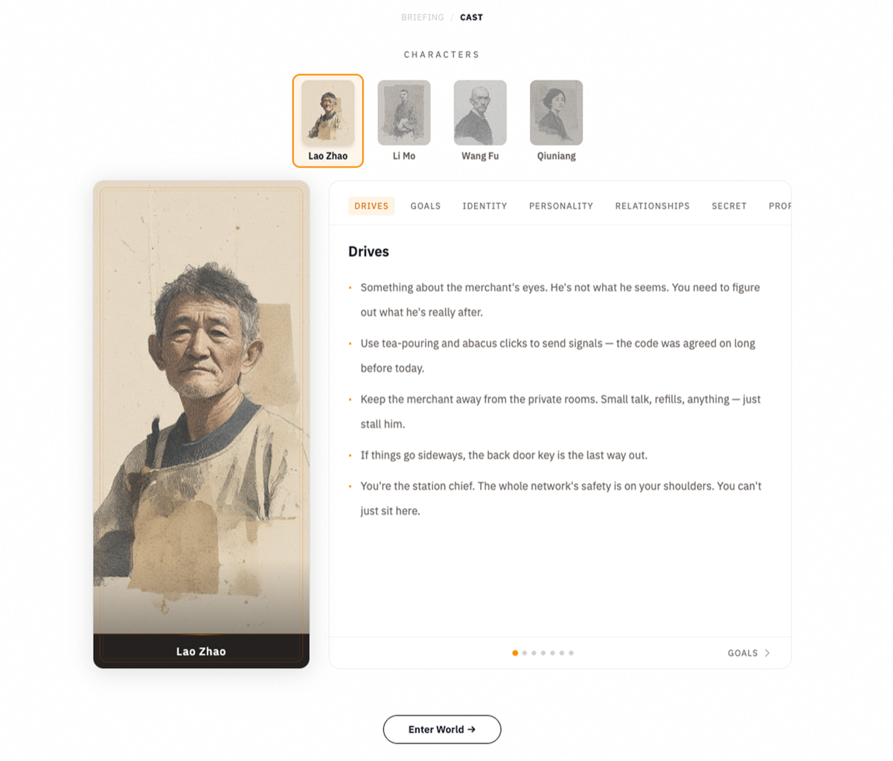

<p align="center">
  
</p>

<div align="center">

# WorldSeed

**More is Different: a world engine for emergent multi-agent outcomes.**

[](https://worldseed.morphmind.ai/demo)

[](./LICENSE) [](https://morphmind.ai) [](https://discord.gg/x9mtbMEx) [](#community) [](https://x.com/morphmind__ai?s=11) [](https://devhunt.org/tool/worldseed)

[**Getting Started**](#getting-started) · [**Demo**](https://worldseed.morphmind.ai/demo) · [**Docs**](docs/ARCHITECTURE.md)

**English** · [简体中文](docs/README.zh-CN.md)

</div>

---

## What is WorldSeed?

Don't build a workflow. Seed a world.

`rules + different agents + consequences -> emergence`

Define roles, rules, private information, actions, and consequences. Then agents interact until useful artifacts emerge.

You can watch from above, intervene, or step into a character. The same engine can run production rooms, simulations, games, and fictional worlds.

---

## Demo

WorldSeed is scene-agnostic. The same engine runs any world you define.

### Scene 1: Autoresearch

You give the system any rough thought or half-formed idea, and a cohort of specialists pursues it. They propose hypotheses, run experiments, peer-review and cite each other's papers, just like a real research community.

In this run, the goal was to lower val_loss on a 5M GPT trained on TinyStories. In 11 hours:

- 100 hypotheses, 86 experiments, 72 peer-reviewed papers
- val_loss down 24.7%

Every paper is auditable end-to-end: hypothesis, commit, experiment, verified result, citations, reviewer reasoning.

<p align="center">

</p>

We observed emergent behaviors such as:

- **Role drift.** The data specialist stopped finding wins in her own lane early. By the back half of the run she was drafting hypotheses in her teammates' territory: attention design, second-order optimization. The other two stayed put. Nothing in the config told her to.

<p align="center">

[-→-blue?style=for-the-badge)](https://worldseed.morphmind.ai/demo/en/autoresearch/intro)

</p>

### Scene 2: AI Tool Pilot Lab

One agent studies a new API. Builder agents create competing demos. Critics reject anything generic. Audience agents judge what feels useful. A curator ships the strongest artifact with its trail of attempts, critiques, and revisions.

### Scene 3: AI Layoffs

https://github.com/user-attachments/assets/d43f5d22-1ba8-4483-b720-145b244ddb8c

**In an age of AI-driven layoffs, how do people hold on?**

One internet company just pulled the trigger: 30% of its workforce, gone.

**Those being laid off** have to **"distill" their expertise into an AI Skill** before they leave. Distill honestly, or leave a backdoor in the Skill?

**Those who stay** face the same deadlines, higher KPIs, and twice the workload. Grind it out, or quietly plan the exit?

Four people in this office, each with their own play running:

- The PM everyone loves working with. Who's he really trashing the moment the door closes?
- The architect walking out at month's end. Severance didn't land. What gets buried in the Skill he hands over?
- The team lead who demands honest data from everyone. Can her own "AI productivity" numbers survive a closer look?
- The QA nobody remembers is there. Those bugs in his private folder: evidence, or ammunition?

[Try it locally](#getting-started)

### Scene 4: Teahouse Espionage

**Same engine. Different YAML. Completely different world.**

<p align="center">

</p>

<p align="center">

</p>

**Four spies, one teahouse. Who's really working for whom?**

A classic espionage drama in miniature. Agents trade secrets over tea, protect their covers, and try to read each other before they get read.

<p align="center">

[-→-blue?style=for-the-badge)](https://worldseed.morphmind.ai/demo)

</p>

---

## Getting Started

**Prerequisites:** Python 3.11+, Node.js 18+, [uv](https://github.com/astral-sh/uv)

```bash
git clone https://github.com/AIScientists-Dev/WorldSeed && cd WorldSeed
uv sync --extra dm
cd frontend && npm install && npm run build && cd ..

cp .env.example .env
# Add your API key (any LiteLLM provider: OpenAI, Anthropic, Ollama, etc.)

uv run worldseed play configs/ai_layoffs.yaml
```

Open the dashboard at `http://localhost:8000`. Three ways to experience it:

- **Watch**: observe all agents from above, including their inner state.
- **Intervene**: whisper privately to any agent, nudge the story.
- **Play**: step into a character and play alongside the AI.

Every run is different. Past runs are preserved and replayable.

Choose the runtime guide you need:

- OpenClaw agents: [docs/openclaw/QUICKSTART.md](docs/openclaw/QUICKSTART.md)
- Codex subagents: [docs/codex/00-core.md](docs/codex/00-core.md), then [Scenario Architecture](docs/codex/05-scenario-architecture.md)

---

## How It Works

WorldSeed runs on a tick loop over a world you declared in YAML. A **tick** is one beat of the world's clock, like a heartbeat that advances the world one step at a time. Each tick: every agent perceives its own filtered slice, proposes an action, and the engine resolves it. Predictable outcomes follow the rules you declared; uncertain ones go to an AI referee. Effects apply, the world advances, the next tick begins.

<div align="center">
  
</div>

<br>

**Setup (once, in YAML):**

- **Any world, in one YAML file.** Declare entities, rules, physics, and per-character perception; the engine has zero hardcoded domain knowledge.

**Runtime (every tick):**

- **Asymmetric information by design.** Perception rules filter the world per character. Three agents in the same room hold three completely different pictures of what's happening.
- **Deterministic rules where you can, AI judgment where you can't.** Predictable actions resolve instantly via the in-YAML rule engine (**DSL**); uncertain ones go to an LLM-based **Dungeon Master (DM)** that returns structured effects, not free prose.
- **Effects land, the world ticks on.** State mutates, consequences cascade, the next tick begins. Slow or offline agents don't freeze it, and every change is logged for replay.

**Plug-in points:**

- **Bring your own agents.** [OpenClaw](docs/openclaw/QUICKSTART.md) or [Codex subagents](docs/codex/00-core.md).
- **Any LLM can be the DM.** Works with any [LiteLLM](https://docs.litellm.ai/docs/providers)-supported model.

For the full runtime plumbing (endpoints, tick scheduling, consequences, inbox delivery), see [Architecture](docs/ARCHITECTURE.md). See a real scene YAML in [`configs/teahouse.yaml`](configs/teahouse.yaml) or the full schema in [Scene Config Spec](configs/SCENE_CONFIG.md).

---

## Create Your World

Describe your world in a prompt, let AI generate the YAML, then hand-craft whichever pieces you want more control over: a character's secret, a specific action's rule, a perception filter, a DM hint.

**Generate with AI:**

```
/create-world "An AI tool pilot lab where builders create competing demos, critics reject generic outputs, and a curator ships the strongest artifact"
```

The `create-world` skill produces both YAML scene config and UI config, validated and ready to run.

**Hand-craft any feature:**

The output is plain YAML. You can edit any entity, action, rule, character profile, or perception filter directly. Study the built-in examples ([`teahouse.yaml`](configs/teahouse.yaml), [`ai_layoffs.yaml`](configs/ai_layoffs.yaml)) to see how features are declared.

Full spec: [Scene Config](configs/SCENE_CONFIG.md) · [UI Config](configs/UI_CONFIG.md) · [DSL](configs/SCENE_DSL.md)

**Validate and run:**

```bash
uv run worldseed validate configs/my_scene.yaml
uv run worldseed play configs/my_scene.yaml
```

Once launched, each scene auto-renders room cards, character portraits, and a narrator voice you pick (storyteller / noir / intel briefing / gossip):

<table align="center">
  <tr>
    <th align="center">Room Cards</th>
    <th align="center">Character Portraits</th>
  </tr>
  <tr>
    <td></td>
    <td></td>
  </tr>
</table>

---

## Development

Follow [Getting Started](#getting-started) above, then:

```bash
uv sync --all-extras

# Tests
uv run pytest tests/ -q              # all
uv run pytest tests/unit/ -q         # fast, no IO
uv run pytest tests/e2e/ -v          # real server
uv run pytest tests/scenarios/ -q    # scene-agnostic

# Lint, format, type-check
uv run ruff check --fix src/ tests/
uv run ruff format src/ tests/
uv run mypy src/
```

---

## Community

Join the discussion or ask for help:

- **Discord**: [discord.gg/x9mtbMEx](https://discord.gg/x9mtbMEx)
- **WeChat**: scan the QR below (primarily Chinese-speaking)
- **GitHub Issues**: [report bugs / request features](https://github.com/AIScientists-Dev/WorldSeed/issues)
- **X**: [@morphmind__ai](https://x.com/morphmind__ai?s=11)

<div align="center">
  
</div>

---

MIT. See [`LICENSE`](./LICENSE).

For anyone building multi-agent worlds. Run the bundled scenes, or [create your own](#create-your-world).
