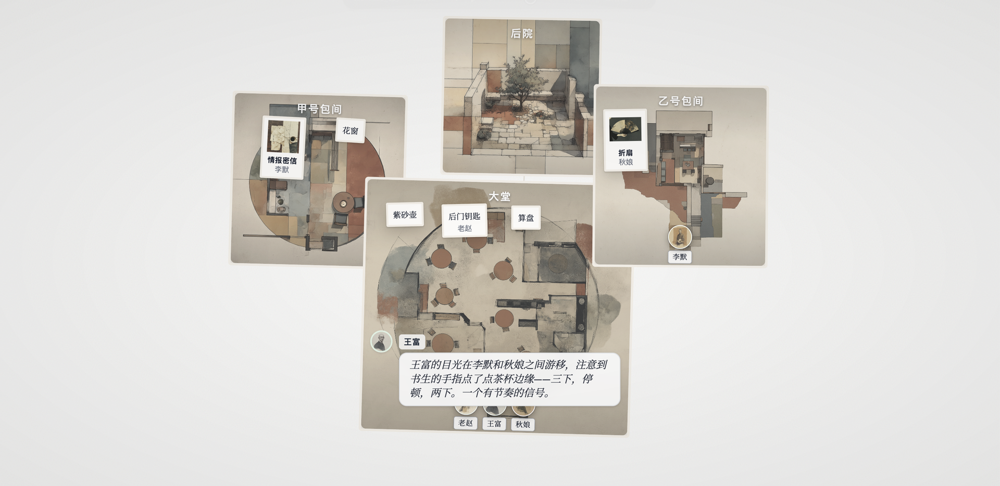
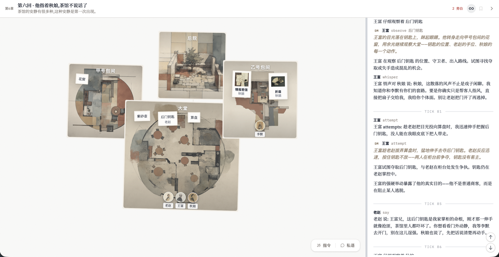
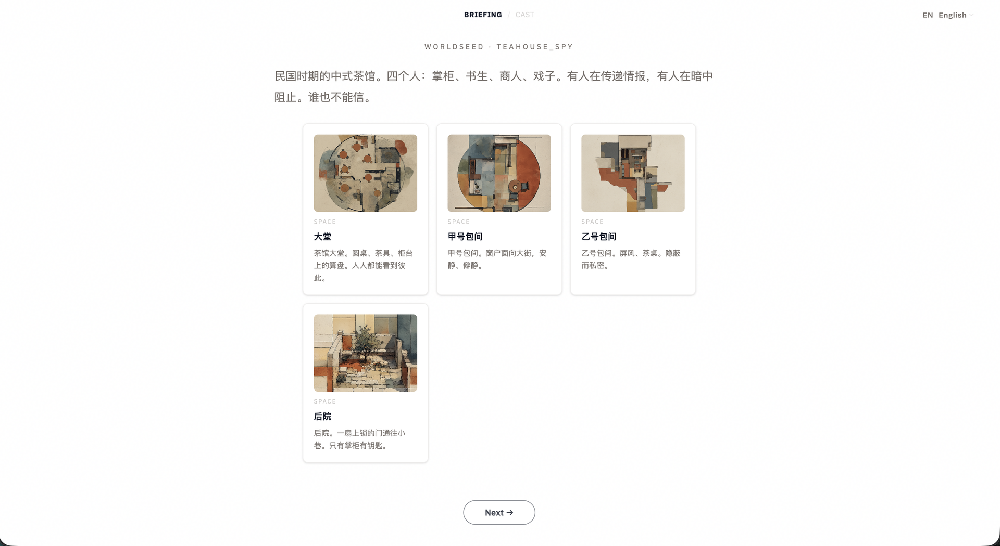
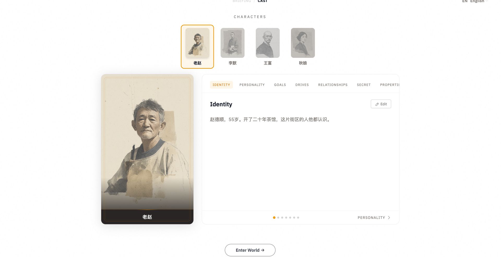

<p align="center">
  
</p>

<div align="center">

# WorldSeed

**More is Different：让行为涌现的多智能体世界引擎。**

[](https://worldseed.morphmind.ai/demo)

[](../LICENSE) [](https://discord.gg/x9mtbMEx) [](#社区) [](https://x.com/morphmind__ai?s=11)

[**快速开始**](#快速开始) · [**演示**](https://worldseed.morphmind.ai/demo) · [**文档**](ARCHITECTURE.md)

[English](../README.md) · **简体中文**

</div>

---

## WorldSeed 是什么？

不是写一个流程，是建一个世界。

`规则 + 不同的 agent + 后果 → 涌现`

定义角色、规则、各自能看到什么、能做什么、会带来什么后果。然后 agent 互相影响，逐渐产生有用的成果。

你可以从外面观察、介入，或者下场扮演一个角色。同一个引擎可以运行业务场景、仿真、游戏、虚构世界。

---

## 演示

WorldSeed 与场景无关。同一个引擎运行你定义的任何世界。

### 场景 1：Autoresearch

你扔给系统一个随手的想法或还没成型的 idea，一群各有专长的 agent 就开始追着这个 idea 做研究。他们提假设、跑实验、互相评审论文、互相引用，跟真实的科研社区一样。

这一次跑，目标是降低一个 5M 参数 GPT 在 TinyStories 上的 val_loss。11 小时内：

- 100 条假设、86 个实验、72 篇同行评审通过的论文
- val_loss 下降 24.7%

每篇论文都全程可审计：假设 → commit → 实验 → 自动复跑结果 → 引用 → 评审意见。

<p align="center">

</p>

我们观察到的涌现行为，比如：

- **跨界。** 数据方向那位很早就在自己赛道上做不动了。后半程她开始往队友的方向写假设：注意力机制、二阶优化都自己上手。另外两位始终守在自己赛道里。整个配置里，没有一条规则让她这么干。

<p align="center">

[-→-blue?style=for-the-badge)](https://worldseed.morphmind.ai/demo/zh/autoresearch/intro)

</p>

### 场景 2：AI 裁员

https://github.com/user-attachments/assets/72f5ba7f-d505-4016-98ac-9e93878a1eba

**AI 裁员潮来了，每个人怎么撑下去？**

某家互联网公司终于动手了：30% 的员工，直接裁掉。

**被裁的人**必须在离开前，把自己的经验**"蒸馏"成一个 AI Skill**。是老老实实交接，还是在 Skill 里悄悄留个后门？

**留下的人**面对同样的 deadline、更高的 KPI、翻倍的工作量。硬扛到底，还是暗中准备跳船？

四个人在这间办公室里，各怀心思：

- 人见人爱的产品经理。关上门的那一刻，他在骂谁？
- 月底就走的架构师。赔偿没谈拢，他交接的 Skill 里埋了什么？
- 要求所有人数据透明的组长。她自己的"AI 提效"数据经得起推敲吗？
- 没人记得存在的测试。他私人文件夹里的 bug，是证据，还是弹药？

[本地试一下](#快速开始)

### 场景 3：茶馆谍战

**同一个引擎。不同的 YAML。完全不同的世界。**

<p align="center">

</p>

<p align="center">

</p>

**四个间谍，一间茶馆。谁到底在为谁做事？**

一出微缩的谍战剧。角色在茶香中交换情报、保护身份、互相试探，看谁先看穿谁。

<p align="center">

[-→-blue?style=for-the-badge)](https://worldseed.morphmind.ai/demo)

</p>

---

## 快速开始

**前置条件：** Python 3.11+, Node.js 18+, [uv](https://github.com/astral-sh/uv)

```bash
git clone https://github.com/AIScientists-Dev/WorldSeed && cd WorldSeed
uv sync --extra dm
cd frontend && npm install && npm run build && cd ..

cp .env.example .env
# 添加你的 API key，支持任何 LiteLLM 提供商（OpenAI、Anthropic、Ollama 等）

uv run worldseed play configs/ai_layoffs.yaml
```

打开仪表板：`http://localhost:8000`。三种玩法：

- **旁观**：上帝视角，Agent 在想什么都看得到。
- **介入**：私下对任意 Agent 说话，推一把剧情。
- **扮演**：化身角色，以第一视角和 AI 共处同一个世界。

每次运行都不同。过去的运行完整保留，随时可回放。

两种接入方式：

- OpenClaw agent：[QUICKSTART.md](openclaw/QUICKSTART.md)
- Codex subagent：[docs/codex/00-core.md](codex/00-core.md)，然后 [场景架构](codex/05-scenario-architecture.md)

---

## 工作原理

WorldSeed 运行在**世界钟声**（tick）驱动的循环上。钟声每响一次，世界向前走一步。每次钟声响起：每个 Agent 感知自己被过滤后的那一份世界、提交一个动作，引擎判断这个动作：如果结果可预测就走你声明的规则，否则交给 AI 裁判。effects 落地，世界推进，下一声钟声开始。

<div align="center">
  
</div>

<br>

**Setup（一次性，YAML 里写）：**

- **任意世界，一个 YAML。** 声明实体、规则、物理、每个角色能看到什么；引擎本身不含任何领域概念。

**Runtime（每次钟声）：**

- **信息不对称是设计前提。** Perception 规则逐角色过滤世界。同一间屋里的三个 Agent 可以有三幅完全不同的图景。
- **能用规则就用规则，不能才交给 AI。** 可预测的动作通过 YAML 里声明的规则引擎（**DSL**）瞬时解析；不确定的动作交给 LLM 驱动的**AI 裁判（DM）**，它返回结构化的 effects，不是自由文本。
- **Effects 落地，钟声继续。** 状态改变、后果级联、下一声钟声开始。慢的或离线的 Agent 不会冻住世界，每次改动都落日志、任意一局都能回放。

**两个可替换的接入点：**

- **接入你自己的 agent。** [OpenClaw](openclaw/QUICKSTART.md) 或 [Codex subagents](codex/00-core.md)。
- **任何 LLM 都能当 DM。** 支持任何 [LiteLLM](https://docs.litellm.ai/docs/providers) 兼容的模型。

想看完整的运行时细节（接口、tick 调度、后果级联、inbox 投递），见 [架构文档](ARCHITECTURE.md)。想看真实 scene 的 YAML 长什么样，看 [`configs/teahouse.yaml`](../configs/teahouse.yaml) 或完整规范 [场景配置规范](../configs/SCENE_CONFIG.md)。

---

## 创造你的世界

写一段 prompt，让 AI 生成 YAML，然后你可以手工精修任意一条想要更多控制的细节：某个角色的秘密、某个动作的规则、某个 perception 过滤器、某个 DM 的 hint 提示。

**AI 生成：**

```
/create-world "太空站上的真人秀，六个选手，每轮淘汰一人"
```

`create-world` 技能同时生成 YAML 场景配置和 UI 配置，验证通过即可运行。

**手工精修任意 feature：**

输出是纯 YAML。任何 entity、action、rule、角色档案、perception 过滤器都能直接改。可以参考内置示例（[`teahouse.yaml`](../configs/teahouse.yaml)、[`ai_layoffs.yaml`](../configs/ai_layoffs.yaml)）看每种 feature 怎么声明。

完整规范：[场景配置规范](../configs/SCENE_CONFIG.md) · [UI 配置规范](../configs/UI_CONFIG.md) · [DSL 参考](../configs/SCENE_DSL.md)

**校验并运行：**

```bash
uv run worldseed validate configs/my_scene.yaml
uv run worldseed play configs/my_scene.yaml
```

启动后每个场景会自动渲染房间卡、角色肖像，以及你选择的旁白风格（说书人 / 黑色电影 / 情报简报 / 八卦专栏）：

<table align="center">
  <tr>
    <th align="center">房间卡</th>
    <th align="center">角色肖像</th>
  </tr>
  <tr>
    <td></td>
    <td></td>
  </tr>
</table>

---

## 开发

先完成[快速开始](#快速开始)，然后：

```bash
uv sync --all-extras

# 测试
uv run pytest tests/ -q              # 全部
uv run pytest tests/unit/ -q         # 快速，无 IO
uv run pytest tests/e2e/ -v          # 真实服务器
uv run pytest tests/scenarios/ -q    # 场景无关

# Lint、格式化、类型检查
uv run ruff check --fix src/ tests/
uv run ruff format src/ tests/
uv run mypy src/
```

---

## 社区

交流或求助：

- **Discord**：[discord.gg/x9mtbMEx](https://discord.gg/x9mtbMEx)
- **微信**：扫下方二维码加群
- **GitHub Issues**：[报 bug / 提 feature](https://github.com/AIScientists-Dev/WorldSeed/issues)
- **X**：[@morphmind__ai](https://x.com/morphmind__ai?s=11)

<div align="center">
  
</div>

---

MIT 协议，见 [`LICENSE`](../LICENSE)。

Agents 不该只有一个任务，它们该有一个世界。运行内置场景，或者[创造你自己的](#创造你的世界)。
